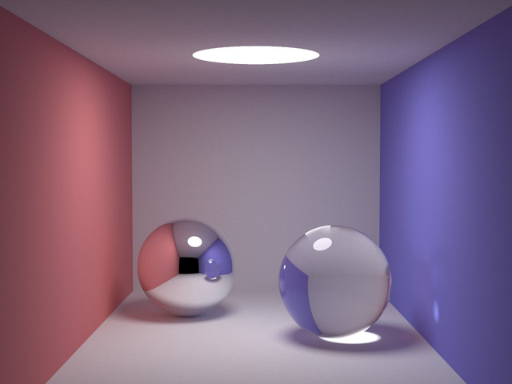
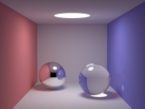
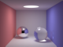
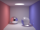
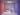

# mipmap

A simple impelementation of generate mipmap from given texture (POT and NPOT)

## running examples

    mipmap --mode 1 result640.jpg

## result
640x480

320x240

160x120

80x60

40x30

20x15

10x7

5x3

2x1

1x1

